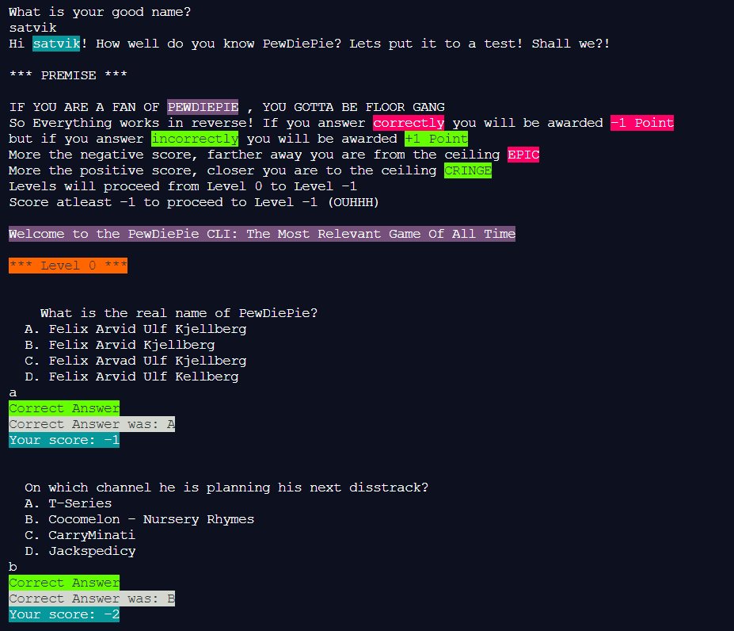

# PewDiePie-CLI-App

Built a <b>CLI Quiz Game</b> for my favorite youtuber <b>Pewdiepie</b> with a little bit of twist.
 
The most relevant game of all time (after <b>TuberSimulator</b> of course).
 
A part of submission of an assignment for <b>neogcamp.</b>
 

### View Live Demo
<pre><a href="https://repl.it/@satvikchachra/PewDiePieCLI?embed=1&output=1"><b>repl.it/@satvikchachra/PewDiePieCLI</b></a></pre>

### Features

* User Answers are evaluated.
* User Score is kept.

### How the game works?

So Everything works in reverse! 
 
If you answer <b>correctly</b> you will be awarded <b>-1 Point</b>,
 
but if you answer <b>incorrectly</b> you will be awarded <b>+1 Point</b>

More the negative score, farther away you are from the ceiling (EPIC)
 
More the positive score, closer you are to the ceiling (CRINGE)
 
Levels will proceed from Level 0 to Level -1
 
<b>Score at least -1 to proceed to Level -1</b>

### Image

  
Landing Page

    

Let's find out how well you know him.
 
This illustrates the use of NodeJS.
 

Have fun playing.

##### Built with ♥ by <a href="https://github.com/satvikchachra">satvikchachra</a>

